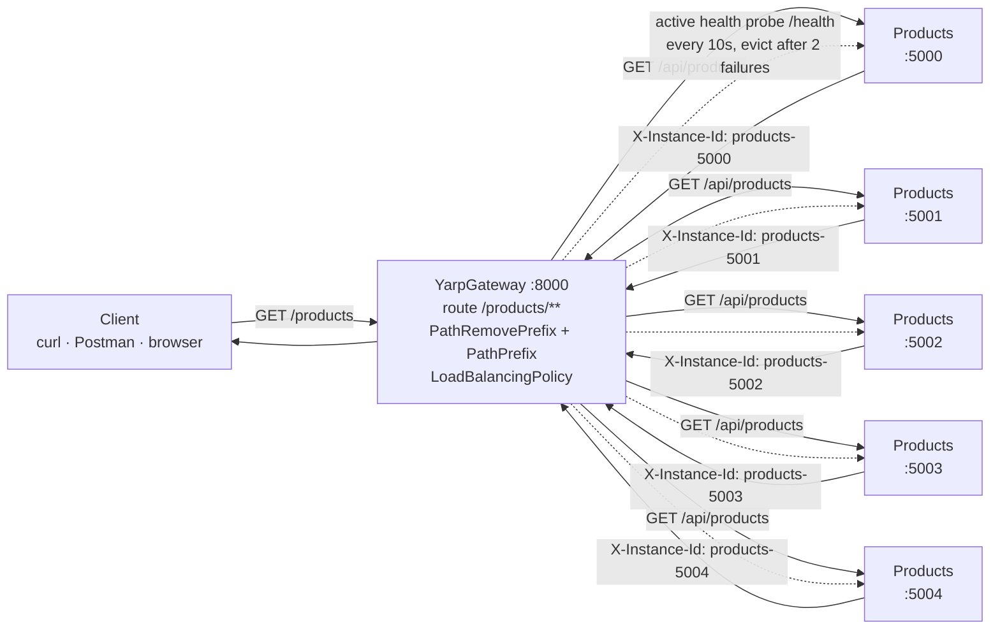

<h1 align="center">YARP Load Balancing — .NET Reference Demo</h1>

<p align="center">
  A runnable, production-shaped demonstration of every load-balancing algorithm in YARP,<br/>
  routing a single gateway across five live <code>Products</code> API instances.
</p>

<p align="center">
  
  
  
  
</p>

---

## Introduction

**YARP** — *Yet Another Reverse Proxy* — is Microsoft's reverse proxy toolkit for .NET. It is not a packaged appliance like NGINX or HAProxy; it is a **library you host inside your own ASP.NET Core application**. You get routing, load balancing, health checking, session affinity and request/response transforms out of the box, and because the whole pipeline is ordinary ASP.NET Core middleware, anything it does not do you can write in C# and drop into the same request path.

That design is what makes it a natural **API Gateway**. A gateway is the single front door to a fleet of services: it terminates TLS, authenticates the caller, enforces rate limits, rewrites paths, and then picks *which* backend instance actually handles the request. YARP handles the plumbing at close to the throughput of a native proxy — it forwards on `System.IO.Pipelines` with pooled buffers and HTTP/2 multiplexing — while leaving the policy decisions in your language, your solution, your tests and your CI pipeline.

**Load balancing is the part of that job that decides where each request goes**, and it is where a gateway earns or loses its keep:

- **Horizontal scale.** Five instances only deliver five instances' worth of throughput if traffic actually reaches all five. A poor distribution leaves capacity idle while a hot instance saturates.
- **Tail latency.** P99 is dominated by the *unluckiest* requests. A policy that avoids busy instances cuts the tail far more than adding hardware does.
- **Resilience.** Combined with health checks, load balancing drains traffic from a failing instance before users notice — and restores it automatically when the instance recovers.
- **Cost.** Balancing well is the difference between running five right-sized instances and over-provisioning eight to absorb the imbalance.

The choice of algorithm is a genuine engineering trade-off, not a default to accept unexamined. Round Robin is perfectly fair and completely blind to load. Least Requests is maximally responsive and does nothing at all without concurrency. Power of Two Choices buys most of the benefit of both for O(1) cost. **This repository makes those trade-offs observable**: every instance reports which one it is, so you can switch policy, fire requests, and watch the distribution change.

## Demo Architecture Overview

Five identical instances of a minimal-API `Products` service run on ports **5000–5004**. Each stamps its own identity onto every response — in the JSON body as `servedBy`, and in an `X-Instance-Id` header — so the routing decision is visible from plain `curl`.

A separate **`YarpGateway`** project listens on port **8000** and reverse-proxies `/products` across all five, rewriting the path to `/api/products` on the way through. Active health checks probe `/health` every 10 seconds and evict an instance after two consecutive failures, so stopping a backend is a first-class part of the demo rather than a crash.

The load-balancing policy lives in `appsettings.json` and is **hot-reloadable** — change one string, save, and the next request uses the new algorithm with no restart.



**Repository layout**

```
YARP-Load-balancing/
├─ src/
│  ├─ Products/                         Minimal-API backend, run 5× on 5000-5004
│  │  ├─ Models/                        Product, InstanceInfo, ProductsResponse
│  │  ├─ Services/                      Catalogue + instance identity resolution
│  │  └─ Program.cs                     GET /api/products, GET /health
│  └─ YarpGateway/                      The reverse proxy, :8000
│     ├─ LoadBalancing/                 Custom WeightedRoundRobin policy
│     ├─ appsettings.json               Routes, cluster, destinations, policy
│     └─ Program.cs                     AddReverseProxy + GET /gateway/clusters
├─ docs/algorithms/                     One deep-dive per algorithm
└─ scripts/                             start / stop / test, PowerShell + Bash
```

**Endpoints**

| Endpoint | Serves |
|----------|--------|
| `GET http://localhost:8000/products` | Load-balanced product catalogue, via the gateway |
| `GET http://localhost:8000/gateway/clusters` | Live policy, destination health and in-flight request counts |
| `GET http://localhost:8000/gateway/health` | Gateway liveness |
| `GET http://localhost:500X/api/products` | A single instance directly, bypassing the gateway |
| `GET http://localhost:500X/health` | Probed by the gateway's active health checks |

## Load Balancing Algorithms

Every algorithm below is documented in depth — internals, a Mermaid flow diagram, a five-request walkthrough, use cases, trade-offs and working configuration. **Each write-up includes the distribution actually measured against this running cluster**, including the cases where a policy does something other than what its name suggests.

| Algorithm | In one line | Cost | Load-aware | Deterministic | Deep dive |
|-----------|-------------|------|:----------:|:-------------:|-----------|
| **Round Robin** | Cycles through destinations with a per-cluster atomic counter — perfectly even, totally load-blind. | O(1) | No | Yes | [round-robin.md](docs/algorithms/round-robin.md) |
| **Power of Two Choices** | Samples two destinations at random, takes the less busy. YARP's **default**; near-optimal balance at O(1). | O(1) | Yes | No | [power-of-two-choices.md](docs/algorithms/power-of-two-choices.md) |
| **Least Requests** | Scans all destinations and picks the fewest in-flight. Most responsive — and inert without concurrency. | O(n) | Yes | Yes | [least-requests.md](docs/algorithms/least-requests.md) |
| **Random** | One uniform draw, zero state. Cheapest and most scalable; visibly lumpy over short runs. | O(1) | No | No | [random.md](docs/algorithms/random.md) |
| **First Alphabetical** | Always the lowest destination ID that is healthy. Not balancing — active/passive **failover**. | O(n) | No | Yes | [first-alphabetical.md](docs/algorithms/first-alphabetical.md) |
| **Custom** | Implement `ILoadBalancingPolicy`. This repo ships a working **WeightedRoundRobin**. | Yours | Yours | Yours | [custom.md](docs/algorithms/custom.md) |

> **Choosing one:** default to **Power of Two Choices** unless you have a specific reason not to. Use **Round Robin** for homogeneous instances and uniform request costs, **Least Requests** for long-running or highly variable work under real concurrency, **First Alphabetical** for primary/standby failover, and a **Custom** policy when instances differ in capacity or the decision depends on the request itself.

## How to Run the Demo

### Prerequisites

- [.NET SDK 10.0](https://dotnet.microsoft.com/download) or later — verify with `dotnet --version`
- `curl` (bundled with Windows 10+, macOS and Linux), or Postman
- Ports **5000–5004** and **8000** free

### 1. Clone and build

```bash
git clone <your-fork-url> YARP-Load-balancing
cd YARP-Load-balancing
dotnet build YarpLoadBalancing.slnx -c Release
```

### 2. Start everything

The scripts launch all six processes detached, write their logs to `.run/*.log`, record the PIDs, and wait until the gateway is actually serving traffic before returning.

**Windows (PowerShell):**

```powershell
./scripts/start-demo.ps1
```

**Linux / macOS (Bash):**

```bash
chmod +x scripts/*.sh
./scripts/start-demo.sh
```

<details>
<summary><strong>Or start each process by hand</strong> — six terminals, no scripts</summary>

Terminals 1–5, one per instance:

```bash
dotnet run --project src/Products/Products.csproj -c Release -- --urls http://localhost:5000
dotnet run --project src/Products/Products.csproj -c Release -- --urls http://localhost:5001
dotnet run --project src/Products/Products.csproj -c Release -- --urls http://localhost:5002
dotnet run --project src/Products/Products.csproj -c Release -- --urls http://localhost:5003
dotnet run --project src/Products/Products.csproj -c Release -- --urls http://localhost:5004
```

Terminal 6, the gateway:

```bash
dotnet run --project src/YarpGateway/YarpGateway.csproj -c Release -- --urls http://localhost:8000
```

Each instance derives its own ID from the port it bound to, so no extra configuration is needed. Visual Studio and Rider users can pick the `products-5000` … `products-5004` launch profiles instead.

</details>

### 3. Send a request through the gateway

```bash
curl -i http://localhost:8000/products
```

```http
HTTP/1.1 200 OK
Content-Type: application/json; charset=utf-8
X-Instance-Id: products-5000

{
  "servedBy": {
    "id": "products-5000",
    "host": "WESAM",
    "port": 5000,
    "processId": 25408,
    "startedAtUtc": "2026-09-13T08:53:27.5461506+00:00"
  },
  "products": [
    { "id": 1, "name": "Mechanical Keyboard", "category": "Peripherals", "price": 129.99, "stockQuantity": 42 },
    { "id": 2, "name": "27\" 4K Monitor", "category": "Displays", "price": 379.00, "stockQuantity": 18 }
  ],
  "count": 6
}
```

The `servedBy` block and the `X-Instance-Id` header are the whole point — they name the instance that handled this specific request.

### 4. Watch the load balancing

Fire a batch of requests and count where they landed.

**PowerShell:**

```powershell
./scripts/test-load-balancing.ps1 -Requests 25
```

**Bash:**

```bash
./scripts/test-load-balancing.sh 25
```

**Or a one-liner, no scripts:**

```bash
for i in $(seq 1 25); do
  curl -s http://localhost:8000/products | grep -o '"id":"products-[0-9]*"'
done | sort | uniq -c
```

Under the shipped `RoundRobin` policy the output is a clean, repeating cycle. The *starting* instance depends on the internal ordering of the destination list rather than on the order in `appsettings.json`, so your first line may differ — the cycle and the even split will not:

```
   1  ->  products-5000
   2  ->  products-5001
   3  ->  products-5002
   4  ->  products-5003
   5  ->  products-5004
   6  ->  products-5000
   ...

Distribution over 25 requests:
Instance       Hits  Share
products-5000     5  20.0%
products-5001     5  20.0%
products-5002     5  20.0%
products-5003     5  20.0%
products-5004     5  20.0%
```

### 5. Switch the algorithm without restarting

Open [`src/YarpGateway/appsettings.json`](src/YarpGateway/appsettings.json) and change one string:

```json
"products-cluster": {
  "LoadBalancingPolicy": "PowerOfTwoChoices"
}
```

Save the file. `LoadFromConfig` watches the section and re-applies the cluster to live traffic — no restart, no dropped requests. Confirm what the gateway actually loaded:

```bash
curl -s http://localhost:8000/gateway/clusters
```

Then re-run step 4 and compare. Valid values: `RoundRobin`, `PowerOfTwoChoices`, `Random`, `LeastRequests`, `FirstAlphabetical`, and the custom `WeightedRoundRobin`.

> **Two results worth reproducing**, because they contradict the names: under **`LeastRequests`**, 15 *sequential* requests all land on one instance — with no concurrency every in-flight count ties at zero, so the strict comparison always returns the first destination. Under **`FirstAlphabetical`**, every request lands on `products-5000` by design; it is a failover policy, not a balancing one. Both are explained in their deep dives.

### 6. Test health-check failover

Kill one instance and watch YARP route around it:

```bash
# Find and stop the instance on port 5002
# Windows:  Get-NetTCPConnection -LocalPort 5002 | Select-Object -Expand OwningProcess | Stop-Process -Force
# Linux:    kill $(lsof -t -i:5002)

curl -s http://localhost:8000/gateway/clusters   # products-5002 -> "Unhealthy" after two probe cycles
./scripts/test-load-balancing.sh 20              # traffic now splits four ways
```

Restart it and the next probe returns it to the rotation automatically.

### 7. See a load-aware policy actually react

Load-aware policies need concurrency and uneven cost to differentiate. Start one instance deliberately slow:

```bash
dotnet run --project src/Products/Products.csproj -c Release -- \
  --urls http://localhost:5002 --Instance:LatencyMs 400
```

Switch the cluster to `LeastRequests`, then drive parallel load:

```powershell
1..50 | ForEach-Object -Parallel {
    (Invoke-RestMethod 'http://localhost:8000/products').servedBy.id
} -ThrottleLimit 10 | Group-Object | Sort-Object Name
```

`products-5002` accumulates in-flight requests and receives a visibly smaller share.

### 8. Stop the demo

```powershell
./scripts/stop-demo.ps1
```

```bash
./scripts/stop-demo.sh
```

### Using Postman

Import a single request — `GET http://localhost:8000/products` — and add this to its **Tests** tab to log the serving instance on every send:

```javascript
pm.test("Served by a known instance", () => {
    const instance = pm.response.headers.get("X-Instance-Id");
    console.log("served by:", instance);
    pm.expect(instance).to.match(/^products-500[0-4]$/);
});
```

Hit **Send** repeatedly, or use the Collection Runner with 25 iterations, and watch the console cycle through the ports.

---

## Further Reading

- [YARP documentation](https://microsoft.github.io/reverse-proxy/) — official reference
- [YARP load balancing reference](https://microsoft.github.io/reverse-proxy/articles/load-balancing.html)
- [Destination health checks](https://microsoft.github.io/reverse-proxy/articles/dests-health-checks.html)
- Mitzenmacher, *The Power of Two Choices in Randomized Load Balancing* (1996) — the result behind YARP's default policy
