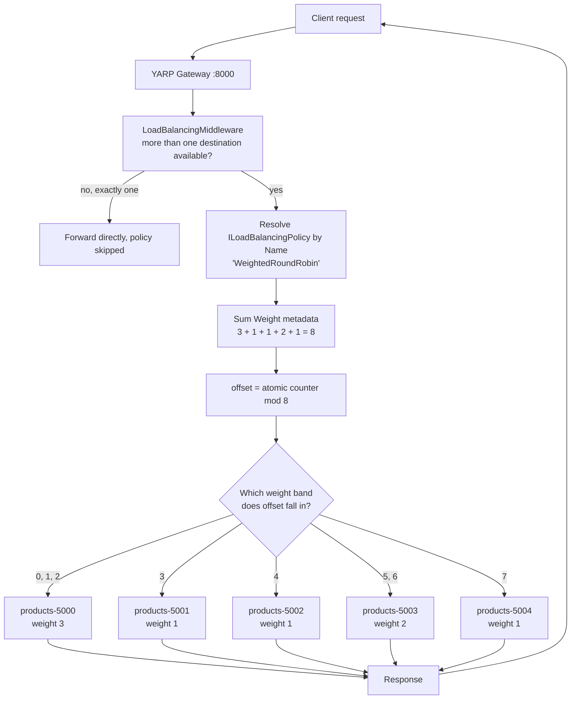

# Custom Load Balancing Policy

## Overview

When none of the five built-in policies expresses your routing rule, YARP lets you supply your own. A custom policy is a class implementing `Yarp.ReverseProxy.LoadBalancing.ILoadBalancingPolicy` — two members, no base class, no attributes:

```csharp
public interface ILoadBalancingPolicy
{
    // The name matched against Clusters:*:LoadBalancingPolicy in configuration.
    string Name { get; }

    DestinationState? PickDestination(
        HttpContext context,
        ClusterState cluster,
        IReadOnlyList<DestinationState> availableDestinations);
}
```

Registration is an ordinary DI registration; YARP collects every `ILoadBalancingPolicy` from the container and indexes them by `Name` (case-insensitive). Names must be unique, and a name that no registration satisfies is a configuration error at cluster load time, not a silent fallback.

Four contract rules govern the implementation:

1. **`availableDestinations` is already filtered** by health checks and, where configured, by session affinity. Never re-read `cluster.DestinationsState.AllDestinations` to make the choice — you would be routing to destinations the proxy has deliberately excluded.
2. **The method is on the hot path** — once per proxied request, on many threads at once. It must be thread-safe, fast and allocation-free. Keep any mutable state in a `ConditionalWeakTable<ClusterState, T>` so it is scoped per cluster and collected when the cluster is removed from configuration.
3. **Returning `null` is legitimate** and produces a `503 Service Unavailable`. Return `null` only when genuinely nothing is eligible.
4. **It is not always called.** `LoadBalancingMiddleware` invokes a policy only when more than one destination is available; with exactly one it forwards directly.

Everything a decision might need is in reach: the full `HttpContext` (headers, claims, path, client IP), the `ClusterState` including its configuration and metadata, and each `DestinationState` with its address, metadata, health and live `ConcurrentRequestCount`.

This repository ships a working example — **`WeightedRoundRobin`**, in [`src/YarpGateway/LoadBalancing/WeightedRoundRobinLoadBalancingPolicy.cs`](../../src/YarpGateway/LoadBalancing/WeightedRoundRobinLoadBalancingPolicy.cs). Weighted balancing is the single most commonly requested policy YARP does not ship, and it is exactly what you need when instances differ in size: a 6-vCPU node should not receive the same share as a 2-vCPU node.

The algorithm is a stride over the cumulative weight range. Each destination reads an integer `Weight` from its configuration metadata (defaulting to 1); a per-cluster atomic counter is taken modulo the total weight, and the resulting offset is walked down the destination list until it falls inside a destination's band. Selection is O(n), allocation-free and lock-free.

## System Architecture & Flow



## Walkthrough Example

Weights as configured in this repository: `5000` = 3, `5001` = 1, `5002` = 1, `5003` = 2, `5004` = 1. Total weight is 8, so the cycle has period 8. The cumulative bands are:

| Offset | 0 | 1 | 2 | 3 | 4 | 5 | 6 | 7 |
|--------|---|---|---|---|---|---|---|---|
| Destination | 5000 | 5000 | 5000 | 5001 | 5002 | 5003 | 5003 | 5004 |

Five sequential `GET http://localhost:8000/products` calls, counter starting at 0:

| # | Counter | `counter % 8` | Band walk | Destination chosen |
|---|---------|---------------|-----------|--------------------|
| 1 | 0 | 0 | `0 - 3 = -3` → inside 5000's band | **`products-5000`** |
| 2 | 1 | 1 | `1 - 3 = -2` → inside 5000's band | **`products-5000`** |
| 3 | 2 | 2 | `2 - 3 = -1` → inside 5000's band | **`products-5000`** |
| 4 | 3 | 3 | `3 - 3 = 0`, then `0 - 1 = -1` | **`products-5001`** |
| 5 | 4 | 4 | past 5000 and 5001, lands in 5002 | **`products-5002`** |

Requests 6–8 go to `5003`, `5003`, `5004`, completing one period. Note the shape: `5000` receives its three requests **consecutively**, not spread out. This stride implementation is exactly proportional over a full cycle but *bursty* within one — see the trade-offs below.

> **Measured on this repository.** Sixteen sequential requests — two full periods — produced exactly **6 / 2 / 2 / 4 / 2** across ports 5000–5004: precisely the configured 3 : 1 : 1 : 2 : 1 ratio, with no drift.

## Best Use Cases

A custom policy is warranted whenever the routing decision depends on information the built-ins cannot see:

- **Heterogeneous instance sizes** — the `WeightedRoundRobin` case here. Mixed VM or container sizes, or mixed hardware generations, where capacity is known in advance and static.
- **Gradual traffic shifting** — canary releases and progressive rollouts, by ramping a destination's weight from 1 to 50 without redeploying the gateway.
- **Zone, region or rack affinity** — prefer destinations whose metadata matches the gateway's own zone, falling back to remote ones only when local destinations are unhealthy. This is the single biggest lever on both latency and cross-AZ data transfer cost.
- **Tenant or claim-based routing** — read a tenant ID from `HttpContext` and pin it to a shard, while still balancing within that shard.
- **Consistent hashing** — route by a hash of user ID or cache key so that related requests reach the same instance, with bounded disruption when membership changes.
- **Cost- or latency-aware routing** — blend `ConcurrentRequestCount` with an out-of-band signal such as observed P99 latency or spot-instance pricing.

Before writing one, check the cheaper options: session affinity handles stickiness, and health-check policies handle "avoid the broken ones". A custom policy is for genuinely custom *selection* logic.

## Trade-offs

- **Pros:**
  - Total control over selection, with the full `HttpContext`, cluster and destination state in scope.
  - Plain DI registration — no fork of YARP, no reflection, no proxy internals to subclass.
  - Composes cleanly with everything else: health checks, session affinity, transforms and the destination filters all still apply.
  - Configured by name in `appsettings.json`, so it is swappable at runtime alongside the built-ins.
  - Trivially unit-testable — the interface takes plain arguments and returns a destination; no host required.
- **Cons:**
  - You now own hot-path code. A lock, an allocation or an `await` here is paid on **every proxied request**.
  - You own the correctness too: bugs surface as skewed traffic or 503s under production load, not as build failures.
  - Per-cluster state must be scoped and collected carefully — a plain `static Dictionary` keyed by cluster leaks as configuration changes.
  - Upgrades become your problem: `ILoadBalancingPolicy` is stable, but you are coupled to YARP's internal state model.
  - The specific stride algorithm shipped here is **bursty**: weight 3 produces three consecutive hits rather than an interleaved spread. For smoother distribution, implement nginx-style *smooth weighted round robin*, which tracks a running current-weight per destination and costs a short lock or a per-destination interlocked update.
  - Weights are static configuration. They cannot react to an instance that is temporarily degraded — combine with health checks, or blend in `ConcurrentRequestCount`.

## Implementation in .NET (YARP)

**The policy** — [`src/YarpGateway/LoadBalancing/WeightedRoundRobinLoadBalancingPolicy.cs`](../../src/YarpGateway/LoadBalancing/WeightedRoundRobinLoadBalancingPolicy.cs), as shipped:

```csharp
using System.Runtime.CompilerServices;
using Yarp.ReverseProxy.LoadBalancing;
using Yarp.ReverseProxy.Model;

namespace YarpGateway.LoadBalancing;

public sealed class WeightedRoundRobinLoadBalancingPolicy : ILoadBalancingPolicy
{
    public const string PolicyName = "WeightedRoundRobin";
    public const string WeightMetadataKey = "Weight";
    private const int DefaultWeight = 1;

    // Keyed on ClusterState so counters are collected when a cluster is removed from config.
    private readonly ConditionalWeakTable<ClusterState, RequestCounter> _counters = new();

    public string Name => PolicyName;

    public DestinationState? PickDestination(
        HttpContext context,
        ClusterState cluster,
        IReadOnlyList<DestinationState> availableDestinations)
    {
        if (availableDestinations.Count == 0)
        {
            return null;
        }

        var totalWeight = 0;
        foreach (var destination in availableDestinations)
        {
            totalWeight += GetWeight(destination);
        }

        if (totalWeight <= 0)
        {
            return availableDestinations[0];
        }

        var counter = _counters.GetOrCreateValue(cluster);
        var offset = (int)(counter.Next() % (uint)totalWeight);

        foreach (var destination in availableDestinations)
        {
            offset -= GetWeight(destination);
            if (offset < 0)
            {
                return destination;
            }
        }

        return availableDestinations[^1];
    }

    private static int GetWeight(DestinationState destination)
    {
        var metadata = destination.Model.Config.Metadata;

        return metadata is not null
               && metadata.TryGetValue(WeightMetadataKey, out var raw)
               && int.TryParse(raw, out var weight)
               && weight > 0
            ? weight
            : DefaultWeight;
    }

    private sealed class RequestCounter
    {
        private long _value = -1;

        public uint Next() => (uint)(Interlocked.Increment(ref _value) & 0x7FFFFFFF);
    }
}
```

**Registration** — `src/YarpGateway/Program.cs`:

```csharp
using Yarp.ReverseProxy.LoadBalancing;
using YarpGateway.LoadBalancing;

var builder = WebApplication.CreateBuilder(args);

builder.Services
    .AddReverseProxy()
    .LoadFromConfig(builder.Configuration.GetSection("ReverseProxy"));

// Custom policies are plain DI registrations; YARP resolves them by their Name property.
builder.Services.AddSingleton<ILoadBalancingPolicy, WeightedRoundRobinLoadBalancingPolicy>();

var app = builder.Build();
app.MapReverseProxy();
app.Run();
```

**Configuration** — `src/YarpGateway/appsettings.json`. The policy is selected by the same string as any built-in, and weights ride along as per-destination metadata:

```json
{
  "ReverseProxy": {
    "Clusters": {
      "products-cluster": {
        "LoadBalancingPolicy": "WeightedRoundRobin",
        "HealthCheck": {
          "Active": {
            "Enabled": true,
            "Policy": "ConsecutiveFailures",
            "Interval": "00:00:10",
            "Timeout": "00:00:05",
            "Path": "/health"
          }
        },
        "Metadata": { "ConsecutiveFailuresHealthPolicy.Threshold": "2" },
        "Destinations": {
          "products-5000": {
            "Address": "http://localhost:5000/",
            "Metadata": { "Weight": "3" }
          },
          "products-5001": {
            "Address": "http://localhost:5001/",
            "Metadata": { "Weight": "1" }
          },
          "products-5002": {
            "Address": "http://localhost:5002/",
            "Metadata": { "Weight": "1" }
          },
          "products-5003": {
            "Address": "http://localhost:5003/",
            "Metadata": { "Weight": "2" }
          },
          "products-5004": {
            "Address": "http://localhost:5004/",
            "Metadata": { "Weight": "1" }
          }
        }
      }
    }
  }
}
```

**Unit testing** — the interface takes plain arguments, so no host is needed:

```csharp
[Fact]
public void Distributes_traffic_in_proportion_to_weight()
{
    var policy  = new WeightedRoundRobinLoadBalancingPolicy();
    var cluster = new ClusterState("products-cluster");
    var destinations = new[]
    {
        Destination("products-5000", weight: 3),
        Destination("products-5001", weight: 1)
    };

    var hits = new Dictionary<string, int>();
    for (var i = 0; i < 8; i++)          // two full periods of weight 4
    {
        var picked = policy.PickDestination(new DefaultHttpContext(), cluster, destinations)!;
        hits[picked.DestinationId] = hits.GetValueOrDefault(picked.DestinationId) + 1;
    }

    Assert.Equal(6, hits["products-5000"]);
    Assert.Equal(2, hits["products-5001"]);
}
```

**Verify it end to end** against the running demo:

```bash
# Confirm the policy and the weights the gateway actually loaded
curl -s http://localhost:8000/gateway/clusters

# 16 requests = two full periods -> expect 6 / 2 / 2 / 4 / 2
docker compose --profile tools run --rm -e REQUESTS=16 loadtest
```

---

**See also:** [Round Robin](round-robin.md) · [Power of Two Choices](power-of-two-choices.md) · [Least Requests](least-requests.md) · [Random](random.md) · [First Alphabetical](first-alphabetical.md) · [Back to README](../../README.md)
