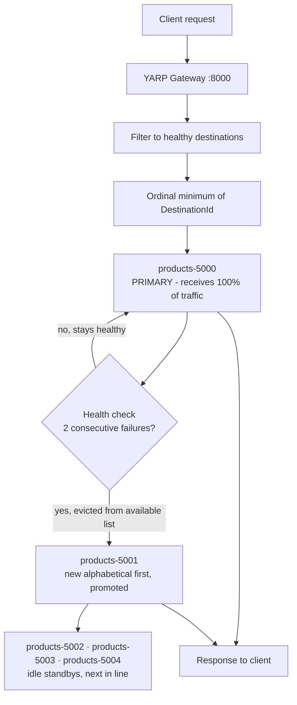

# First Alphabetical

## Overview

First Alphabetical always selects the available destination whose **destination ID sorts first** by ordinal string comparison. It is not a balancing policy at all — it is a deterministic *primary/standby* selector:

```csharp
// Yarp.ReverseProxy.LoadBalancing.FirstAlphabeticalLoadBalancingPolicy (conceptual)
if (availableDestinations.Count == 0) return null;

var result = availableDestinations[0];
for (var i = 1; i < availableDestinations.Count; i++)
{
    var candidate = availableDestinations[i];
    if (string.CompareOrdinal(candidate.DestinationId, result.DestinationId) < 0)
    {
        result = candidate;
    }
}

return result;
```

The key is the word **available**. The policy receives only destinations that have passed health checks, so its real behaviour is: *send everything to the alphabetically first healthy destination, and fail over to the next one only when that destination becomes unhealthy*. All traffic sits on one instance; the others are warm standbys.

Two details bite in practice:

- **The comparison is ordinal, not culture-aware or numeric.** `"products-10"` sorts *before* `"products-9"`, because `'1' < '9'` character by character. Zero-pad IDs (`products-09`) if ordering matters to you.
- **Selection is by destination *ID*, the key in the `Destinations` dictionary — not by address, not by declaration order.** Renaming a key changes routing; reordering the JSON does not.

Failover is not instantaneous. With the active health check configured in this repository — a 10-second interval and a `ConsecutiveFailures` threshold of 2 — a dead primary is detected after two failed probes, which in practice means roughly 20 to 30 seconds depending on where the failure falls in the probe cycle. Requests routed to it during that window fail. Passive health checks, which react to real request failures, shorten that window considerably.

## System Architecture & Flow



## Walkthrough Example

Five sequential `GET http://localhost:8000/products` calls against a fully healthy cluster.

| # | Available destination IDs | Ordinal minimum | Destination chosen |
|---|---------------------------|-----------------|--------------------|
| 1 | `products-5000` … `products-5004` | `products-5000` | **`products-5000`** |
| 2 | `products-5000` … `products-5004` | `products-5000` | **`products-5000`** |
| 3 | `products-5000` … `products-5004` | `products-5000` | **`products-5000`** |
| 4 | `products-5000` … `products-5004` | `products-5000` | **`products-5000`** |
| 5 | `products-5000` … `products-5004` | `products-5000` | **`products-5000`** |

All five requests hit the same instance. Ports 5001–5004 serve nothing while 5000 is healthy — and that is the correct, intended outcome.

Now stop `products-5000`:

| # | Available destination IDs | Ordinal minimum | Destination chosen |
|---|---------------------------|-----------------|--------------------|
| 6 | `products-5001` … `products-5004` | `products-5001` | **`products-5001`** — promoted |
| 7 | `products-5001` … `products-5004` | `products-5001` | **`products-5001`** |

Restart `products-5000` and, one health probe later, traffic snaps back to it — the policy has no hysteresis, so recovery is immediate and total.

> **Measured on this repository.** Fifteen sequential requests under `FirstAlphabetical` all returned `X-Instance-Id: products-5000`. The other four instances received nothing. Verified as specified.

## Best Use Cases

- **Active/passive failover** — a designated primary with hot standbys ready to take over, without a separate orchestration layer.
- **Blue/green and canary cutovers**, where the winning destination is chosen by naming convention (`a-green` sorts before `b-blue`) and a rename flips all traffic at once.
- **Cache or connection-pool locality** — pinning all traffic to one instance maximises its local cache hit rate and keeps exactly one warm connection pool to downstream systems.
- **Singleton-ish workloads** — schedulers, leader-elected components, or stateful services where concurrent instances would conflict.
- **Deterministic test and CI environments**, where "which instance served this?" must have exactly one answer.
- **Licence- or cost-constrained backends**, where a secondary instance should only be engaged if the primary is down.

## Trade-offs

- **Pros:**
  - Fully deterministic and trivially explainable: the winner is the smallest ID, always.
  - Provides real failover semantics with zero extra configuration — health checks alone drive promotion.
  - Maximises cache locality, JIT warm-up and connection reuse on a single instance.
  - O(n) but allocation-free, with no counters and no state to keep consistent across gateway replicas.
  - Every gateway replica independently agrees on the same primary, with no coordination protocol.
- **Cons:**
  - **It does not balance load.** One instance absorbs 100% of traffic while the rest sit idle — capacity you are paying for and not using.
  - The primary is a throughput ceiling and a single point of saturation; the cluster cannot scale horizontally.
  - Failover latency is bounded by the health-check interval times the failure threshold — roughly 20 to 30 seconds with the settings in this repository, measured.
  - Ordinal sorting is a footgun: `products-10` precedes `products-9`, so unpadded numeric suffixes route somewhere surprising.
  - Routing is coupled to naming, so an innocuous rename silently redirects all production traffic.
  - No hysteresis: a flapping primary drags traffic back and forth on every probe cycle.

## Implementation in .NET (YARP)

`src/YarpGateway/appsettings.json`. Health checking is not optional here — it is the mechanism that makes failover work at all:

```json
{
  "ReverseProxy": {
    "Routes": {
      "products-route": {
        "ClusterId": "products-cluster",
        "Match": { "Path": "/products/{**catch-all}" },
        "Transforms": [
          { "PathRemovePrefix": "/products" },
          { "PathPrefix": "/api/products" }
        ]
      }
    },
    "Clusters": {
      "products-cluster": {
        "LoadBalancingPolicy": "FirstAlphabetical",
        "HealthCheck": {
          "Active": {
            "Enabled": true,
            "Policy": "ConsecutiveFailures",
            "Interval": "00:00:10",
            "Timeout": "00:00:05",
            "Path": "/health"
          },
          "Passive": {
            "Enabled": true,
            "Policy": "TransportFailureRate",
            "ReactivationPeriod": "00:00:30"
          }
        },
        "Metadata": { "ConsecutiveFailuresHealthPolicy.Threshold": "2" },
        "Destinations": {
          "products-5000": { "Address": "http://localhost:5000/" },
          "products-5001": { "Address": "http://localhost:5001/" },
          "products-5002": { "Address": "http://localhost:5002/" },
          "products-5003": { "Address": "http://localhost:5003/" },
          "products-5004": { "Address": "http://localhost:5004/" }
        }
      }
    }
  }
}
```

Adding the passive check shown above lets YARP demote a destination on real request failures rather than waiting for the next probe, which is usually what you want when one instance carries all the traffic.

`src/YarpGateway/Program.cs` needs no policy-specific code — but exposing which destination is currently primary is worth the five lines:

```csharp
using Yarp.ReverseProxy;

var builder = WebApplication.CreateBuilder(args);

builder.Services
    .AddReverseProxy()
    .LoadFromConfig(builder.Configuration.GetSection("ReverseProxy"));

var app = builder.Build();

// Which destination is currently primary, and which are standing by.
app.MapGet("/gateway/primary", (IProxyStateLookup lookup) =>
{
    var cluster = lookup.GetClusters().First();
    var primary = cluster.DestinationsState.AvailableDestinations
        .OrderBy(d => d.DestinationId, StringComparer.Ordinal)
        .FirstOrDefault();

    return Results.Ok(new
    {
        primary  = primary?.DestinationId,
        standbys = cluster.DestinationsState.AvailableDestinations
            .Select(d => d.DestinationId)
            .Where(id => id != primary?.DestinationId)
            .Order(StringComparer.Ordinal)
    });
});

app.MapReverseProxy();
app.Run();
```

To force the intended ordering explicitly rather than relying on port numbers, name the destinations for their role — zero-padded so ordinal and numeric order agree:

```json
"Destinations": {
  "a-primary":     { "Address": "http://localhost:5000/" },
  "b-standby-01":  { "Address": "http://localhost:5001/" },
  "c-standby-02":  { "Address": "http://localhost:5002/" }
}
```

---

**See also:** [Round Robin](round-robin.md) · [Power of Two Choices](power-of-two-choices.md) · [Least Requests](least-requests.md) · [Random](random.md) · [Custom](custom.md) · [Back to README](../../README.md)
