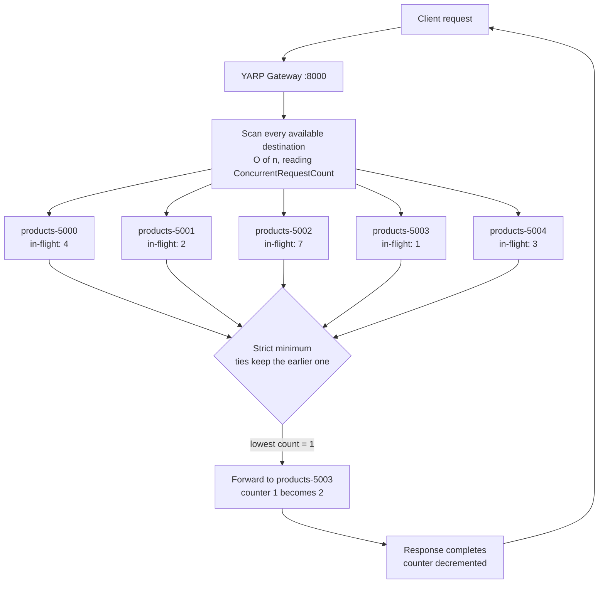

# Least Requests

## Overview

Least Requests forwards each request to the destination with the **fewest in-flight requests right now**. It is the only built-in YARP policy that inspects every available destination on every request:

```csharp
// Yarp.ReverseProxy.LoadBalancing.LeastRequestsLoadBalancingPolicy (conceptual)
if (availableDestinations.Count == 0) return null;

var leastRequests      = availableDestinations[0];
var leastRequestsCount = leastRequests.ConcurrentRequestCount;

for (var i = 1; i < availableDestinations.Count; i++)
{
    var destination = availableDestinations[i];
    var count = destination.ConcurrentRequestCount;
    if (count < leastRequestsCount)
    {
        leastRequests = destination;
        leastRequestsCount = count;
    }
}

return leastRequests;
```

The signal is `DestinationState.ConcurrentRequestCount`: incremented when YARP begins forwarding and decremented when the response finishes streaming. It is therefore a live measure of **work outstanding at this destination, as seen by this gateway** — it includes time spent in the destination's queue, its handler and the response body transfer.

Three consequences shape how it behaves:

1. **Ties resolve to the first destination in the list.** The comparison is strictly `<`, so a later destination never displaces an equal one. When all counts are equal — low traffic, fast handlers — the policy deterministically picks whichever destination happens to sit at index 0.
2. **The view is per gateway process.** A destination shared by several gateway replicas may be busy with traffic this gateway cannot see, and each replica will independently believe it is idle.
3. **It is a herd magnet.** Because the choice is strict rather than sampled, every gateway replica that observes an idle instance sends it the next request simultaneously. This is precisely the failure mode [Power of Two Choices](power-of-two-choices.md) exists to avoid.

Least Requests is self-correcting in a way that Round Robin is not: a destination that slows down accumulates in-flight requests and is automatically skipped until it drains — no health check, no configuration change, no restart.

## System Architecture & Flow



## Walkthrough Example

Five requests arrive in quick succession, each one still in flight when the next arrives — the only regime in which this policy has anything to work with. All counters start at 0.

| # | In-flight before the choice (5000 / 5001 / 5002 / 5003 / 5004) | Minimum | Destination chosen |
|---|---------------------------------------------------------------|---------|--------------------|
| 1 | 0 / 0 / 0 / 0 / 0 | 0, five-way tie | **`products-5000`** — first in the list |
| 2 | 1 / 0 / 0 / 0 / 0 | 0 at 5001 | **`products-5001`** |
| 3 | 1 / 1 / 0 / 0 / 0 | 0 at 5002 | **`products-5002`** |
| 4 | 1 / 1 / 1 / 0 / 0 | 0 at 5003 | **`products-5003`** |
| 5 | 1 / 1 / 1 / 1 / 0 | 0 at 5004 | **`products-5004`** |

Under sustained concurrency the policy fills every instance to one request, then to two, and so on — it behaves like Round Robin *as long as all destinations drain at the same rate*. The difference appears the moment they do not: if `products-5002` takes 400 ms per request while the rest take 5 ms, its counter stays high and requests 6 through N route around it automatically.

> **Measured on this repository.** Fifteen *sequential* requests under `LeastRequests` all landed on a single instance. With no concurrency every counter was 0 at decision time, so every comparison was a tie, and the strict `<` test returned the first destination in the available list — every single time. This is not a bug; it is the defining characteristic of the policy. **Least Requests requires concurrent load to do anything at all.** Reproduce the useful behaviour with a parallel client:
>
> ```powershell
> 1..50 | ForEach-Object -Parallel {
>     (Invoke-RestMethod 'http://localhost:8000/products').servedBy.id
> } -ThrottleLimit 10 | Group-Object | Sort-Object Name
> ```

## Best Use Cases

- **Long-lived or long-running requests** — report generation, file uploads, streaming responses, LLM completions — where in-flight count is a genuine proxy for load.
- **Highly variable request costs on one route**, where Round Robin's fixed rotation would repeatedly hand expensive work to the same instance.
- **Small clusters with a single gateway**, where the O(n) scan is trivial and the herd effect cannot arise.
- **Heterogeneous instance performance you cannot predict in advance** — noisy neighbours, differing JIT warm-up, uneven cache hit rates. The policy discovers the difference instead of being told about it.
- **Graceful degradation** — an instance that is failing slowly gets drained of new traffic before active health checks notice anything is wrong.

## Trade-offs

- **Pros:**
  - The most load-responsive built-in policy: it reacts within a single request, faster than any health check.
  - Automatically routes around slow, saturated or warming-up instances with no configuration.
  - Excellent for uneven workloads, where it substantially outperforms Round Robin on tail latency.
  - Deterministic and inspectable — given the counters, the choice is fully explainable in a post-mortem.
- **Cons:**
  - **Useless without concurrency.** At low traffic every count ties and the policy collapses to "always the first destination", as measured above.
  - O(n) scan on every request; with hundreds of destinations this becomes real per-request overhead. Prefer [Power of Two Choices](power-of-two-choices.md) at that scale.
  - Herd effect across gateway replicas: several gateways can stampede the same idle instance simultaneously.
  - Counts only what *this* gateway forwarded — it cannot see traffic arriving from other gateways or clients.
  - A newly added or newly recovered destination starts at 0 in-flight and absorbs a burst of traffic before it is warm.
  - Concurrency is not load: an instance holding many cheap idle connections looks busier than one pinned at 100% CPU on a single request.

## Implementation in .NET (YARP)

`src/YarpGateway/appsettings.json`:

```json
{
  "ReverseProxy": {
    "Routes": {
      "products-route": {
        "ClusterId": "products-cluster",
        "Match": { "Path": "/products/{**catch-all}" },
        "Transforms": [
          { "PathRemovePrefix": "/products" },
          { "PathPrefix": "/api/products" }
        ]
      }
    },
    "Clusters": {
      "products-cluster": {
        "LoadBalancingPolicy": "LeastRequests",
        "HealthCheck": {
          "Active": {
            "Enabled": true,
            "Policy": "ConsecutiveFailures",
            "Interval": "00:00:10",
            "Timeout": "00:00:05",
            "Path": "/health"
          }
        },
        "Metadata": { "ConsecutiveFailuresHealthPolicy.Threshold": "2" },
        "Destinations": {
          "products-5000": { "Address": "http://localhost:5000/" },
          "products-5001": { "Address": "http://localhost:5001/" },
          "products-5002": { "Address": "http://localhost:5002/" },
          "products-5003": { "Address": "http://localhost:5003/" },
          "products-5004": { "Address": "http://localhost:5004/" }
        }
      }
    }
  }
}
```

`src/YarpGateway/Program.cs` — the gateway in this repository surfaces the exact counters the policy reads, which is what makes the behaviour demonstrable rather than theoretical:

```csharp
using Yarp.ReverseProxy;

var builder = WebApplication.CreateBuilder(args);

builder.Services
    .AddReverseProxy()
    .LoadFromConfig(builder.Configuration.GetSection("ReverseProxy"));

var app = builder.Build();

app.MapGet("/gateway/clusters", (IProxyStateLookup lookup) =>
    Results.Ok(lookup.GetClusters().Select(cluster => new
    {
        clusterId = cluster.ClusterId,
        loadBalancingPolicy = cluster.Model.Config.LoadBalancingPolicy,
        destinations = cluster.DestinationsState.AllDestinations.Select(d => new
        {
            d.DestinationId,
            d.ConcurrentRequestCount,   // the value LeastRequests minimises
            activeHealth = d.Health.Active.ToString()
        })
    })));

app.MapReverseProxy();
app.Run();
```

To make the policy visibly react, slow one backend down. The `Products` service reads an optional latency knob, so starting a single instance with it is enough:

```bash
dotnet run --project src/Products/Products.csproj -- \
  --urls http://localhost:5002 --Instance:LatencyMs 400
```

`products-5002` now holds requests far longer, its `ConcurrentRequestCount` climbs under parallel load, and Least Requests stops choosing it.

---

**See also:** [Power of Two Choices](power-of-two-choices.md) · [Round Robin](round-robin.md) · [Random](random.md) · [First Alphabetical](first-alphabetical.md) · [Custom](custom.md) · [Back to README](../../README.md)
