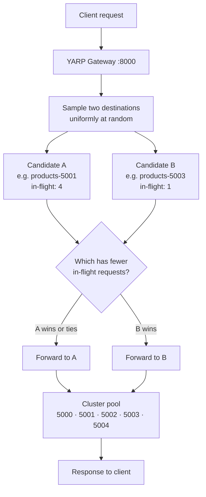

# Power of Two Choices

## Overview

Power of Two Choices — *P2C*, sometimes written "the power of two random choices" — is YARP's **default** policy: it is what runs when `LoadBalancingPolicy` is omitted from a cluster. Instead of scanning every destination for the least busy one, it samples **two destinations uniformly at random** and forwards to whichever of the pair currently has fewer in-flight requests:

```csharp
// Yarp.ReverseProxy.LoadBalancing.PowerOfTwoChoicesLoadBalancingPolicy (conceptual)
if (destinationCount == 0) return null;
if (destinationCount == 1) return availableDestinations[0];

var random = _randomFactory.CreateRandomInstance();
var first  = availableDestinations[random.Next(destinationCount)];
var second = availableDestinations[random.Next(destinationCount)];

return first.ConcurrentRequestCount <= second.ConcurrentRequestCount ? first : second;
```

Two implementation details are easy to miss:

- **The two draws are independent**, so they can select the *same* destination. When that happens the comparison is a no-op and the request goes to that destination — a harmless outcome that costs one extra RNG call.
- **The comparison uses `ConcurrentRequestCount`**, YARP's live in-flight counter, incremented when the request is forwarded and decremented when the response completes. It measures *concurrency*, not latency, queue depth or CPU.

The theoretical appeal is the reason this is the default. With purely random placement of *n* requests over *n* bins, the busiest bin holds roughly `log n / log log n` requests. Sampling two and taking the lesser collapses that to roughly `log log n` — an **exponential** reduction in worst-case imbalance, for the price of one extra random draw. You get most of the benefit of `LeastRequests` at O(1) instead of O(n), and — critically at scale — without the herd effect where every gateway replica simultaneously discovers the same idle instance and stampedes it.

## System Architecture & Flow



## Walkthrough Example

Five requests arrive while earlier work is still in flight, so the in-flight counters are non-zero. `R1..R5` are the random pairs drawn for each request.

| # | Pair sampled | In-flight at sample time | Winner | Why |
|---|--------------|--------------------------|--------|-----|
| 1 | `5002`, `5000` | 3 vs 0 | **`products-5000`** | Fewer in-flight |
| 2 | `5004`, `5004` | 1 vs 1 | **`products-5004`** | Same destination drawn twice; comparison is a no-op |
| 3 | `5001`, `5003` | 2 vs 2 | **`products-5001`** | Tie — the *first* draw wins, because the test is `<=` |
| 4 | `5000`, `5002` | 1 vs 3 | **`products-5000`** | Fewer in-flight; 5000 is picked again, which is expected |
| 5 | `5003`, `5004` | 2 vs 0 | **`products-5004`** | Fewer in-flight |

Result: `5000` ×2, `5001` ×1, `5003` ×0, `5004` ×2. Over five requests the split looks *uneven* — and that is the honest picture. P2C is a probabilistic policy whose guarantee is about the **tail** (no destination gets badly overloaded), not about short-run uniformity.

> **Measured on this repository.** Twenty-five sequential requests under P2C landed 3 / 10 / 5 / 3 / 4 across ports 5000–5004. Because the requests were sequential, every in-flight count was 0 at sample time, so every comparison was a tie and the policy degenerated to "pick the first of two random draws" — pure random selection. **P2C only shows its strength under concurrency.** To see it work, drive the gateway with a concurrent load generator, or set `"Instance": { "LatencyMs": 400 }` on one instance so its counter actually rises.

## Best Use Cases

- **General-purpose production default.** If you have no specific reason to choose otherwise, this is the right policy — which is exactly why YARP picked it.
- **High request rates with real concurrency**, where in-flight counts are meaningfully non-zero and the load signal has information in it.
- **Large clusters** — dozens or hundreds of destinations — where `LeastRequests`' O(n) scan per request becomes measurable overhead.
- **Multiple gateway replicas**, where a strict least-loaded policy would cause every replica to converge on the same "idle" instance at the same moment and overwhelm it.
- **Variable request costs** — long and short requests mixed on the same route — since the in-flight counter naturally reflects work that has not finished.

## Trade-offs

- **Pros:**
  - Near-`LeastRequests` quality of balancing at O(1) cost — two random draws and one comparison.
  - Exponentially better worst-case imbalance than pure `Random`, the classic "power of two choices" result.
  - Randomisation prevents the herd effect that afflicts strict least-loaded policies across multiple gateways.
  - Self-correcting under load: a destination that slows down accumulates in-flight requests and is naturally sampled away from.
  - No coordination, no shared counters, no locks — scales perfectly with gateway concurrency.
- **Cons:**
  - Not deterministic; short-run distributions look lumpy and are awkward to assert on in tests.
  - Degenerates to `Random` when all in-flight counts are equal — notably under low or purely sequential traffic.
  - `ConcurrentRequestCount` is a proxy for load, not a measurement of it: it cannot see CPU saturation, GC pauses or a slow downstream dependency that has not yet produced concurrency.
  - Blind to heterogeneous capacity; a small instance and a large one are sampled with equal probability.
  - The extra RNG call and the possibility of drawing the same destination twice make it marginally less "fair" than it first appears.

## Implementation in .NET (YARP)

`src/YarpGateway/appsettings.json`. Setting the policy explicitly is recommended even though it is the default, because it documents intent:

```json
{
  "ReverseProxy": {
    "Clusters": {
      "products-cluster": {
        "LoadBalancingPolicy": "PowerOfTwoChoices",
        "HealthCheck": {
          "Active": {
            "Enabled": true,
            "Policy": "ConsecutiveFailures",
            "Interval": "00:00:10",
            "Timeout": "00:00:05",
            "Path": "/health"
          }
        },
        "Metadata": { "ConsecutiveFailuresHealthPolicy.Threshold": "2" },
        "Destinations": {
          "products-5000": { "Address": "http://localhost:5000/" },
          "products-5001": { "Address": "http://localhost:5001/" },
          "products-5002": { "Address": "http://localhost:5002/" },
          "products-5003": { "Address": "http://localhost:5003/" },
          "products-5004": { "Address": "http://localhost:5004/" }
        }
      }
    }
  }
}
```

Omitting `LoadBalancingPolicy` entirely selects the same behaviour:

```json
"products-cluster": {
  "Destinations": {
    "products-5000": { "Address": "http://localhost:5000/" }
  }
}
```

`src/YarpGateway/Program.cs` — nothing policy-specific is needed, but this gateway exposes the in-flight counters so the policy's input signal is observable while the demo runs:

```csharp
using Yarp.ReverseProxy;

var builder = WebApplication.CreateBuilder(args);

builder.Services
    .AddReverseProxy()
    .LoadFromConfig(builder.Configuration.GetSection("ReverseProxy"));

var app = builder.Build();

// GET /gateway/clusters -> policy in force, health, and live ConcurrentRequestCount
// per destination: exactly the numbers P2C compares.
app.MapGet("/gateway/clusters", (IProxyStateLookup lookup) =>
    Results.Ok(lookup.GetClusters().Select(cluster => new
    {
        clusterId = cluster.ClusterId,
        loadBalancingPolicy = cluster.Model.Config.LoadBalancingPolicy ?? "PowerOfTwoChoices (default)",
        destinations = cluster.DestinationsState.AllDestinations.Select(d => new
        {
            d.DestinationId,
            d.ConcurrentRequestCount,
            activeHealth = d.Health.Active.ToString()
        })
    })));

app.MapReverseProxy();
app.Run();
```

Poll that endpoint during a concurrent load test to watch the counters move:

```bash
watch -n 0.5 'curl -s http://localhost:8000/gateway/clusters | jq'
```

---

**See also:** [Least Requests](least-requests.md) · [Random](random.md) · [Round Robin](round-robin.md) · [First Alphabetical](first-alphabetical.md) · [Custom](custom.md) · [Back to README](../../README.md)
