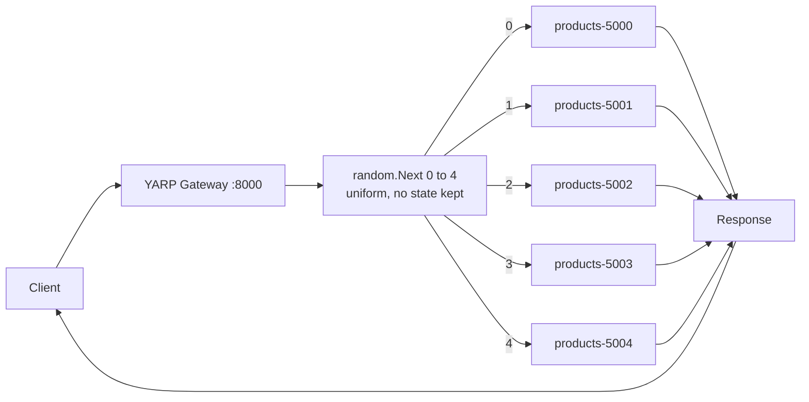

# Random

## Overview

Random draws one destination uniformly from the available list and forwards to it. It is the simplest policy YARP ships and holds no state whatsoever:

```csharp
// Yarp.ReverseProxy.LoadBalancing.RandomLoadBalancingPolicy (conceptual)
if (availableDestinations.Count == 0) return null;

var random = _randomFactory.CreateRandomInstance();
return availableDestinations[random.Next(availableDestinations.Count)];
```

The RNG comes from YARP's `IRandomFactory` abstraction rather than a raw `new Random()`, for two reasons that matter: the underlying generator is thread-safe and contention-free under concurrency, and tests can substitute a deterministic factory to assert on selection.

Because there is **no counter, no scan and no shared mutable state**, Random is stateless in the strongest sense: it is unaffected by gateway restarts, it needs no coordination between gateway replicas, and adding or removing a destination changes nothing except the size of the draw. That last property is genuinely useful — [Round Robin](round-robin.md)'s rotation re-phases when the available list changes, whereas Random's behaviour is identical before and after.

The cost is statistical. Distributing *n* requests randomly over *n* destinations leaves the busiest destination holding roughly `log n / log log n` requests, and over short runs the split is visibly lumpy. Sampling two candidates instead of one collapses that imbalance exponentially, which is exactly what [Power of Two Choices](power-of-two-choices.md) does — and why it, not Random, is YARP's default.

## System Architecture & Flow



## Walkthrough Example

Five sequential `GET http://localhost:8000/products` calls. Each draw is independent of every draw before it.

| # | `random.Next(5)` | Destination chosen | Note |
|---|------------------|--------------------|------|
| 1 | 3 | **`products-5003`** | |
| 2 | 0 | **`products-5000`** | |
| 3 | 3 | **`products-5003`** | Repeat — nothing prevents it |
| 4 | 4 | **`products-5004`** | |
| 5 | 3 | **`products-5003`** | Third hit; `5001` and `5002` have had none |

Result: `5000` ×1, `5001` ×0, `5002` ×0, `5003` ×3, `5004` ×1. This clumping is not a malfunction — it is the expected behaviour of independent uniform draws over a small sample. The distribution converges to even only as the request count grows.

> **Measured on this repository.** Fifteen sequential requests under `Random` landed 2 / 2 / 4 / 6 / 1 across ports 5000–5004. The most-hit instance took six times the traffic of the least-hit one. Run the same test with 1,000 requests and the shares tighten toward 20% each; run it with 15 and they will not.

## Best Use Cases

- **Stateless, uniform, cheap endpoints** where any imbalance is absorbed long before it matters.
- **Very large clusters**, where the law of large numbers does the balancing for you and the absence of per-request work is worth more than precision.
- **Many independent gateway replicas** — Random needs no coordination and produces no herd effect, so *N* gateways behave exactly like one.
- **Chaos and resilience testing**, where unpredictable routing is the point: it exercises every destination eventually, in no particular order.
- **A deliberate baseline.** Measuring a workload under Random and then under a smarter policy is the cleanest way to prove the smarter policy is earning its keep.

## Trade-offs

- **Pros:**
  - Absolutely minimal overhead — one RNG call, no scan, no counter, no allocation.
  - Completely stateless: immune to gateway restarts, and identical in behaviour across any number of gateway replicas.
  - Unaffected by membership churn; adding or removing destinations does not perturb the pattern as it does for Round Robin.
  - Statistically fair over large samples, with no systematic bias toward any destination.
  - No coordination, no locks, no contention — the most horizontally scalable policy available.
- **Cons:**
  - Visibly uneven over short runs, as the measurement above shows; one instance can take several times its share.
  - Entirely load-blind: it will happily hand requests to a saturated instance while another sits idle.
  - Non-deterministic, so it is awkward to assert on in tests and harder to explain in an incident review.
  - No affinity and no cache locality; consecutive related requests scatter across instances.
  - Strictly dominated by [Power of Two Choices](power-of-two-choices.md) for almost all production traffic — same O(1) cost class, exponentially better tail behaviour.

## Implementation in .NET (YARP)

`src/YarpGateway/appsettings.json`:

```json
{
  "ReverseProxy": {
    "Routes": {
      "products-route": {
        "ClusterId": "products-cluster",
        "Match": { "Path": "/products/{**catch-all}" },
        "Transforms": [
          { "PathRemovePrefix": "/products" },
          { "PathPrefix": "/api/products" }
        ]
      }
    },
    "Clusters": {
      "products-cluster": {
        "LoadBalancingPolicy": "Random",
        "HealthCheck": {
          "Active": {
            "Enabled": true,
            "Policy": "ConsecutiveFailures",
            "Interval": "00:00:10",
            "Timeout": "00:00:05",
            "Path": "/health"
          }
        },
        "Metadata": { "ConsecutiveFailuresHealthPolicy.Threshold": "2" },
        "Destinations": {
          "products-5000": { "Address": "http://localhost:5000/" },
          "products-5001": { "Address": "http://localhost:5001/" },
          "products-5002": { "Address": "http://localhost:5002/" },
          "products-5003": { "Address": "http://localhost:5003/" },
          "products-5004": { "Address": "http://localhost:5004/" }
        }
      }
    }
  }
}
```

`src/YarpGateway/Program.cs` requires no policy-specific code:

```csharp
var builder = WebApplication.CreateBuilder(args);

builder.Services
    .AddReverseProxy()
    .LoadFromConfig(builder.Configuration.GetSection("ReverseProxy"));

var app = builder.Build();
app.MapReverseProxy();
app.Run();
```

Because selection is random, integration tests should assert on *coverage* rather than on an exact sequence — that every destination is eventually reached, and that no destination is starved:

```csharp
var hits = new Dictionary<string, int>();

for (var i = 0; i < 500; i++)
{
    using var response = await client.GetAsync("/products");
    var instance = response.Headers.GetValues("X-Instance-Id").Single();
    hits[instance] = hits.GetValueOrDefault(instance) + 1;
}

Assert.Equal(5, hits.Count);                       // every instance was used
Assert.All(hits.Values, count => Assert.True(count > 500 / 5 / 3));  // none starved
```

For deterministic unit tests, replace YARP's RNG by registering your own `IRandomFactory` before `AddReverseProxy`.

---

**See also:** [Power of Two Choices](power-of-two-choices.md) · [Round Robin](round-robin.md) · [Least Requests](least-requests.md) · [First Alphabetical](first-alphabetical.md) · [Custom](custom.md) · [Back to README](../../README.md)
