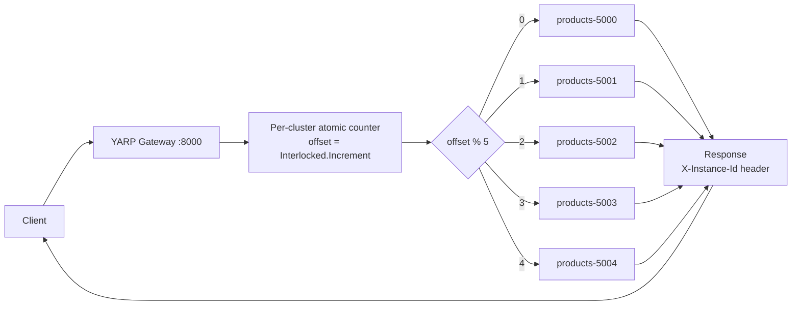

# Round Robin

## Overview

Round Robin hands each successive request to the next destination in the cluster's available list, wrapping back to the start after the last one. YARP implements it with a single monotonically increasing counter held per cluster in a `ConditionalWeakTable<ClusterState, AtomicCounter>`, so the counter lives and dies with the cluster and is never shared between clusters:

```csharp
// Yarp.ReverseProxy.LoadBalancing.RoundRobinLoadBalancingPolicy (conceptual)
var counter = _counters.GetOrCreateValue(cluster);
var offset  = counter.Increment();               // Interlocked.Increment, lock free
return availableDestinations[offset % availableDestinations.Count];
```

Three properties follow directly from that implementation and matter in production:

1. **The counter is per gateway process.** Two gateway replicas each keep their own counter, so perfect *global* fairness is not guaranteed — only per-replica fairness.
2. **The modulus is the *available* destination count, not the configured one.** When a health check evicts a destination the list shrinks and the cycle re-phases: requests that would have gone to index 3 now land elsewhere. The rotation is stable only while membership is stable.
3. **It is load-blind.** The counter knows nothing about in-flight requests, response times or instance size. A destination stuck on slow work receives its next turn regardless.

Round Robin is also short-circuited before it ever runs: YARP's `LoadBalancingMiddleware` only invokes a policy when **more than one** destination is available. With a single healthy destination the policy is never consulted.

## System Architecture & Flow



## Walkthrough Example

Five sequential `GET http://localhost:8000/products` calls against a healthy five-instance cluster, counter starting at 0.

| # | Counter | `counter % 5` | Destination chosen | `X-Instance-Id` returned |
|---|---------|---------------|--------------------|--------------------------|
| 1 | 0       | 0             | `products-5000`    | `products-5000`          |
| 2 | 1       | 1             | `products-5001`    | `products-5001`          |
| 3 | 2       | 2             | `products-5002`    | `products-5002`          |
| 4 | 3       | 3             | `products-5003`    | `products-5003`          |
| 5 | 4       | 4             | `products-5004`    | `products-5004`          |

Request 6 wraps back to `products-5000`. Every instance receives exactly one request in five — the distribution is *deterministic*, which is what makes Round Robin the clearest policy for proving that load balancing is happening at all.

> **Measured on this repository.** Ten sequential requests produced a perfect two-lap cycle across all five ports. Note that the *starting* port depends on the internal ordering of the available-destination list, not on the order destinations appear in `appsettings.json`.

Stop `products-5002` and the active health check marks it unhealthy after two failed probes; the list shrinks to four and the cycle becomes a four-way rotation until it recovers.

## Best Use Cases

- **Homogeneous instances** — identical CPU, memory and container limits, as in a Kubernetes `Deployment` with uniform replicas.
- **Uniform, short request costs** — CRUD reads, cache-backed lookups, health dashboards, where any request costs roughly what any other does.
- **Demonstrations, teaching and smoke tests**, where a predictable, reproducible distribution is worth more than optimal balancing.
- **Capacity baselines** — an even split makes per-instance throughput numbers directly comparable.

## Trade-offs

- **Pros:**
  - Perfectly even distribution under homogeneous load; no instance is statistically favoured.
  - O(1) selection with one interlocked increment — no scanning, no allocation, no contention beyond a single cache line.
  - Fully deterministic, so it is trivial to reason about, assert in tests and demonstrate.
  - Requires no feedback signal from destinations, so it works before any health or latency data exists.
- **Cons:**
  - Load-blind: a slow or degraded instance keeps receiving its full share until health checks remove it outright.
  - Ignores heterogeneous capacity — a 2-core and a 16-core instance get identical traffic.
  - Fairness is per gateway process; with several gateway replicas the global split drifts.
  - Membership changes re-phase the rotation, so it offers no cache locality or stable affinity.
  - Pathological under uneven request costs: if every fifth request is expensive, the same instance absorbs all of them.

## Implementation in .NET (YARP)

`src/YarpGateway/appsettings.json` — the policy is a single string on the cluster:

```json
{
  "ReverseProxy": {
    "Routes": {
      "products-route": {
        "ClusterId": "products-cluster",
        "Match": { "Path": "/products/{**catch-all}" },
        "Transforms": [
          { "PathRemovePrefix": "/products" },
          { "PathPrefix": "/api/products" }
        ]
      }
    },
    "Clusters": {
      "products-cluster": {
        "LoadBalancingPolicy": "RoundRobin",
        "HealthCheck": {
          "Active": {
            "Enabled": true,
            "Policy": "ConsecutiveFailures",
            "Interval": "00:00:10",
            "Timeout": "00:00:05",
            "Path": "/health"
          }
        },
        "Metadata": { "ConsecutiveFailuresHealthPolicy.Threshold": "2" },
        "Destinations": {
          "products-5000": { "Address": "http://localhost:5000/" },
          "products-5001": { "Address": "http://localhost:5001/" },
          "products-5002": { "Address": "http://localhost:5002/" },
          "products-5003": { "Address": "http://localhost:5003/" },
          "products-5004": { "Address": "http://localhost:5004/" }
        }
      }
    }
  }
}
```

`src/YarpGateway/Program.cs` — no policy-specific code is required. `LoadFromConfig` binds the name and watches the section, so editing `LoadBalancingPolicy` and saving re-applies it to live traffic without a restart:

```csharp
var builder = WebApplication.CreateBuilder(args);

builder.Services
    .AddReverseProxy()
    .LoadFromConfig(builder.Configuration.GetSection("ReverseProxy"));

var app = builder.Build();
app.MapReverseProxy();
app.Run();
```

To declare the same cluster in code rather than configuration, use the in-memory provider and the `LoadBalancingPolicies` constants:

```csharp
using Yarp.ReverseProxy.Configuration;
using Yarp.ReverseProxy.LoadBalancing;

builder.Services.AddReverseProxy().LoadFromMemory(
    routes:
    [
        new RouteConfig
        {
            RouteId   = "products-route",
            ClusterId = "products-cluster",
            Match     = new RouteMatch { Path = "/products/{**catch-all}" }
        }
    ],
    clusters:
    [
        new ClusterConfig
        {
            ClusterId            = "products-cluster",
            LoadBalancingPolicy  = LoadBalancingPolicies.RoundRobin,
            Destinations = new Dictionary<string, DestinationConfig>
            {
                ["products-5000"] = new() { Address = "http://localhost:5000/" },
                ["products-5001"] = new() { Address = "http://localhost:5001/" }
            }
        }
    ]);
```

---

**See also:** [Power of Two Choices](power-of-two-choices.md) · [Least Requests](least-requests.md) · [Random](random.md) · [First Alphabetical](first-alphabetical.md) · [Custom](custom.md) · [Back to README](../../README.md)
